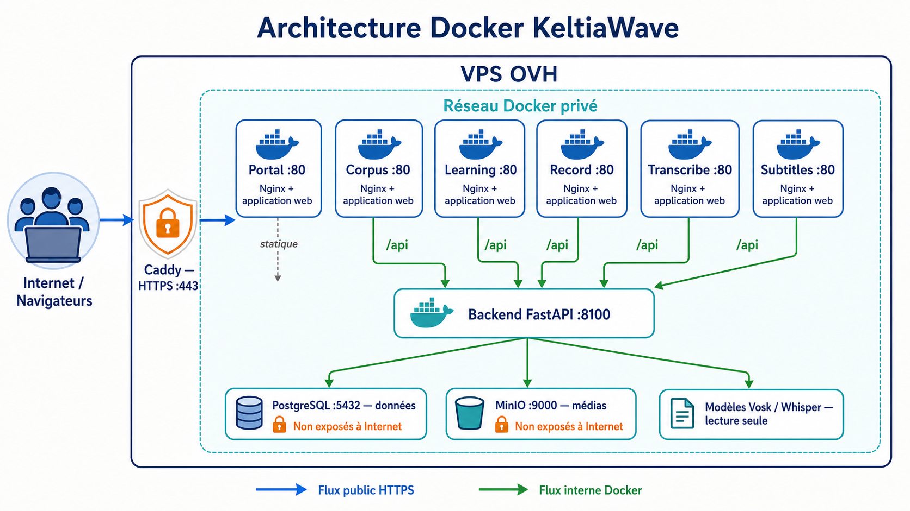

# KeltiaWave

Socle commun regroupant un backend unique et six applications web autonomes :

- **Portal** (`4100`) : page d'accueil et accès à tous les outils ;
- **Corpus** (`4200`) : collecte, validation et administration des voix ;
- **Learning** (`4300`) : vidéos, leçons et exercices ;
- **Record** (`4400`) : enregistrement et comparaison Vosk/Whisper ;
- **Transcribe** (`4500`) : transcription de fichiers audio et vidéo ;
- **Subtitles** (`4600`) : génération, calage et export de sous-titres.

Les projets sources `portal-standalone`, `corpus-collaboratif` et
`breizh-transcriptor-whisper` restent indépendants et ne sont pas modifiés par
cette intégration.

## Architecture

Les six fronts sont déployables séparément. Les cinq outils métier utilisent le
même backend FastAPI (`8100`) ; Portal reste une page statique sans API :

- API vocales spécialisées pour Record, Transcribe et Subtitles ;
- API Corpus, comptes, authentification et rôles ;
- API Learning, progression, médias, leçons et exercices ;
- PostgreSQL pour les données relationnelles en production ;
- MinIO/S3 pour les fichiers audio, vidéo et ressources Learning.



Le trafic public arrive en HTTPS par Caddy. Les applications web transmettent
leurs appels `/api` au backend FastAPI sur le réseau Docker privé. PostgreSQL,
MinIO et les modèles vocaux ne sont jamais interrogés directement par les
navigateurs. Portal est une application statique et n'utilise actuellement pas
l'API.

L'estimation de durée de Transcribe est calibrée dans
`backend/data/transcription-calibration.json`. Ce profil appartient au serveur,
survit aux redémarrages grâce au volume `backend_data` et profite immédiatement
à tous les navigateurs. Les variables `TRANSCRIPTION_DEFAULT_RTF_*` servent de
valeurs initiales sur une installation encore jamais calibrée.

```text
apps/
  portal/
  corpus/
  learning/
  record/
  transcribe/
  subtitles/
backend/
  alembic/             migrations de la base Learning
  app/api/endpoints/   Corpus, comptes et administration
  app/learning/        API Learning
  app/record/          API Record
  app/transcribe/      API Transcribe
  app/subtitles/       API Subtitles
  models/              modèles vocaux locaux non versionnés
deploy/
scripts/
```

## Démarrage local

Prérequis : Python 3.11+, Node.js 20+, npm et FFmpeg.

1. Copiez `.env.example` vers `.env` et remplacez au minimum `SECRET_KEY`.
2. Installez ou liez les modèles décrits dans `backend/models/README.md` :
   `./scripts/link-legacy-models.sh` permet de réutiliser ceux de l'ancien projet.
3. Lancez le backend : `./scripts/start-backend.sh`.
4. Dans un autre terminal, lancez l'application voulue :

```bash
./scripts/start-portal.sh       # http://127.0.0.1:4100
./scripts/start-corpus.sh       # http://127.0.0.1:4200
./scripts/start-learning.sh     # http://127.0.0.1:4300
./scripts/start-record.sh       # http://127.0.0.1:4400
./scripts/start-transcribe.sh   # http://127.0.0.1:4500
./scripts/start-subtitles.sh    # http://127.0.0.1:4600
```

En local, SQLite et le stockage de fichiers local suffisent. Les migrations
Alembic sont appliquées automatiquement au démarrage. Documentation API :
<http://127.0.0.1:8100/docs>.

## Authentification et rôles

Corpus et Learning partagent les mêmes utilisateurs et jetons. Les rôles
principaux sont `learner`, `teacher`, `admin` et `contributor`. Un administrateur
initial peut être créé au démarrage avec les variables `BOOTSTRAP_ADMIN_*`.

Ne versionnez jamais `.env`, les mots de passe, les jetons ou les clés MinIO.

## Docker

Copiez `.env.example` vers `.env`, remplacez impérativement `SECRET_KEY`,
`POSTGRES_PASSWORD` et `MINIO_ROOT_PASSWORD`, puis lancez la pile locale et ses
contrôles de santé :

```bash
./scripts/start-docker.sh
```

Le script construit et démarre tous les conteneurs, vérifie le backend et les
six interfaces, puis ouvre Portal sur <http://127.0.0.1:4100>. Utilisez
`--no-build` pour réutiliser les images existantes ou `--no-browser` pour ne pas
ouvrir le navigateur.

Sur mobile, le portail propose un lanceur compact dans l'ordre Transcribe,
Record, Subtitles, Play, Komz et Library. L'atelier Subtitles place le choix du
média, de la langue et du moteur immédiatement autour de l'aperçu vidéo ; la
matrice conserve davantage de largeur pour le texte grâce à des timecodes
compacts.

PostgreSQL et MinIO restent sur le réseau Docker interne. Seuls le backend et
les six fronts publient des ports. Les volumes `postgres_data`, `minio_data`
et `backend_data` conservent les données entre les redémarrages.

## Vérifications

```bash
npm run build
cd backend && .venv/bin/python -m pytest
```

## Déploiement OVH sans régression

Le staging et la production sont deux piles Docker indépendantes sur OVH. Les
déploiements partent d'une révision Git commise et poussée, construisent les
conteneurs sur des ports liés à `127.0.0.1`, puis vérifient les interfaces, les
données Komz et les médias Play avant toute exposition publique.

```bash
# Mettre à jour le staging persistant
SSH_TARGET=ubuntu@vps-dc75d8a6.vps.ovh.net \
  ./scripts/deploy-staging-ovh.sh --apply

# Construire une candidate production en clonant les données du staging
SSH_TARGET=ubuntu@vps-dc75d8a6.vps.ovh.net \
  ./scripts/deploy-production-candidate-ovh.sh --apply

# Vérifier la candidate et les DNS avant la promotion
SSH_TARGET=ubuntu@vps-dc75d8a6.vps.ovh.net PUBLIC_IPV4=51.178.38.152 \
  ./scripts/promote-production-ovh.sh
```

La procédure, les prérequis et le retour arrière sont détaillés dans
`deploy/ovh/README.md`. Les récapitulatifs de livraison sont disponibles dans
le dossier `docs/`, notamment `docs/CHANGES-2026-09-03.md` pour les interfaces
mobiles Portal et Subtitles.
