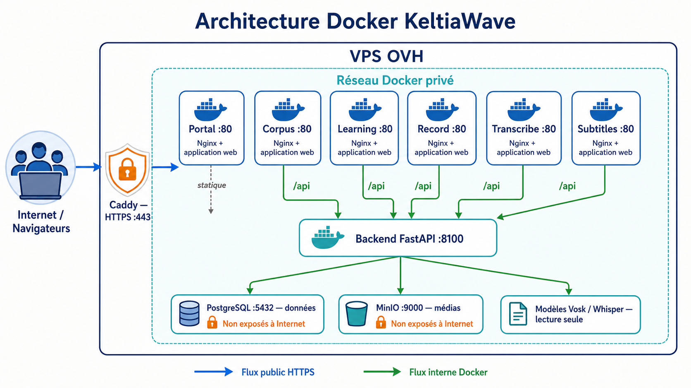

# KeltiaWave

Socle commun regroupant un backend unique et six applications web autonomes :

- **Portal** (`4100`) : page d'accueil et accès à tous les outils ;
- **Corpus** (`4200`) : collecte, validation et administration des voix ;
- **Learning** (`4300`) : vidéos, leçons et exercices ;
- **Record** (`4400`) : enregistrement et comparaison Vosk/Whisper ;
- **Transcribe** (`4500`) : transcription de fichiers audio et vidéo ;
- **Subtitles** (`4600`) : génération, calage et export de sous-titres.

Les projets sources `portal-standalone`, `corpus-collaboratif` et
`breizh-transcriptor-whisper` restent indépendants et ne sont pas modifiés par
cette intégration.

## Architecture

Les six fronts sont déployables séparément. Les cinq outils métier utilisent le
même backend FastAPI (`8100`) ; Portal reste une page statique sans API :

- API vocales spécialisées pour Record, Transcribe et Subtitles ;
- API Corpus, comptes, authentification et rôles ;
- API Learning, progression, médias, leçons et exercices ;
- PostgreSQL pour les données relationnelles en production ;
- MinIO/S3 pour les fichiers audio, vidéo et ressources Learning.



Le trafic public arrive en HTTPS par Caddy. Les applications web transmettent
leurs appels `/api` au backend FastAPI sur le réseau Docker privé. PostgreSQL,
MinIO et les modèles vocaux ne sont jamais interrogés directement par les
navigateurs. Portal est une application statique et n'utilise actuellement pas
l'API.

L'estimation de durée de Transcribe est calibrée dans
`backend/data/transcription-calibration.json`. Ce profil appartient au serveur,
survit aux redémarrages grâce au volume `backend_data` et profite immédiatement
à tous les navigateurs. Les variables `TRANSCRIPTION_DEFAULT_RTF_*` servent de
valeurs initiales sur une installation encore jamais calibrée.

```text
apps/
  portal/
  corpus/
  learning/
  record/
  transcribe/
  subtitles/
backend/
  alembic/             migrations de la base Learning
  app/api/endpoints/   Corpus, comptes et administration
  app/learning/        API Learning
  app/record/          API Record
  app/transcribe/      API Transcribe
  app/subtitles/       API Subtitles
  models/              modèles vocaux locaux non versionnés
deploy/
scripts/
```

## Démarrage local

Prérequis : Python 3.11+, Node.js 20+, npm et FFmpeg.

1. Copiez `.env.example` vers `.env` et remplacez au minimum `SECRET_KEY`.
2. Installez ou liez les modèles décrits dans `backend/models/README.md` :
   `./scripts/link-legacy-models.sh` permet de réutiliser ceux de l'ancien projet.
3. Lancez le backend : `./scripts/start-backend.sh`.
4. Dans un autre terminal, lancez l'application voulue :

```bash
./scripts/start-portal.sh       # http://127.0.0.1:4100
./scripts/start-corpus.sh       # http://127.0.0.1:4200
./scripts/start-learning.sh     # http://127.0.0.1:4300
./scripts/start-record.sh       # http://127.0.0.1:4400
./scripts/start-transcribe.sh   # http://127.0.0.1:4500
./scripts/start-subtitles.sh    # http://127.0.0.1:4600
```

En local, SQLite et le stockage de fichiers local suffisent. Les migrations
Alembic sont appliquées automatiquement au démarrage. Documentation API :
<http://127.0.0.1:8100/docs>.

## Authentification et rôles

Corpus et Learning partagent les mêmes utilisateurs et jetons. Les rôles
principaux sont `learner`, `teacher`, `admin` et `contributor`. Un administrateur
initial peut être créé au démarrage avec les variables `BOOTSTRAP_ADMIN_*`.

Ne versionnez jamais `.env`, les mots de passe, les jetons ou les clés MinIO.

## Docker

Copiez `.env.example` vers `.env`, remplacez impérativement `SECRET_KEY`,
`POSTGRES_PASSWORD` et `MINIO_ROOT_PASSWORD`, puis lancez la pile locale et ses
contrôles de santé :

```bash
./scripts/start-docker.sh
```

Le script construit d'abord l'infrastructure et le backend, puis démarre les six
interfaces après validation de l'API. Il ouvre ensuite la documentation backend
sur <http://127.0.0.1:8100/docs> puis Portal sur <http://127.0.0.1:4100>, qui
donne accès à toutes les applications. Utilisez `--no-build` pour réutiliser les
images existantes ou `--no-browser` pour ne pas ouvrir le navigateur.

Sur mobile, le portail propose un lanceur compact dans l'ordre Transcribe,
Record, Subtitles, Play, Komz et Library. L'atelier Subtitles place le choix du
média, de la langue et du moteur immédiatement autour de l'aperçu vidéo ; la
matrice conserve davantage de largeur pour le texte grâce à des timecodes
compacts.

Le portail présente les outils depuis une page d'accueil multilingue et
transmet la langue choisie à Komz et Listen. En gallois, seuls Transcribe et
Subtitles sont proposés ; en cornique, aucune application n'est affichée.

PostgreSQL et MinIO restent sur le réseau Docker interne. Seuls le backend et
les six fronts publient des ports. Les volumes `postgres_data`, `minio_data`
et `backend_data` conservent les données entre les redémarrages.

## Lot Common Voice dans Komz

Le manifeste `backend/data/common_voice_selected_50.csv` contient 50 phrases
bretonnes sélectionnées, leurs traductions françaises, niveaux A1/A2, thèmes
proposés et noms des meilleurs MP3 Common Voice. Les fichiers audio proviennent
du jeu de données Common Voice breton et ne sont pas versionnés ici. Les champs
`decision`, `traduction_statut` et `niveau_statut` signalent les propositions
éditoriales encore à relire.

Les scripts `backend/scripts/import_selected_phrases.py` et
`backend/scripts/import_selected_common_voice_audios.py` simulent par défaut.
Ils opèrent sur la base configurée par `DATABASE_URL` et exigent `--apply` pour
écrire. Le second script requiert `--audio-root`, un répertoire contenant les
MP3 nommés dans le manifeste. Il réutilise les phrases existantes et crée les
audios avec l'origine `common-voice` et le statut `pending` : les votes Common
Voice ne valent pas validation Komz.

Dans la pile Docker **locale**, les 50 phrases et leurs 50 audios ont été
importés et vérifiés le 1er octobre 2026. Un second lot de 550 phrases et
audios a ensuite été préparé sur 11 thèmes. Le 2 octobre 2026, les 600 phrases
et audios Common Voice ont été transférés sur le staging et la production OVH
via une archive Bibliothèque ZIP ciblée. Les 550 nouveaux audios ont été
approuvés en lot à la demande du propriétaire sans contrôle d'écoute ; les
traductions et niveaux automatiques restent à relire. Pour les thèmes et les
résultats de vérification, voir `docs/komz-themes.md` et
`docs/common-voice-1000.md`.

Listen affiche les thèmes sous forme d'images, puis les phrases avec un audio
approuvé. Niveau, sous-domaine et recherche se combinent. L'utilisateur écoute
d'abord la voix de référence ; le lien vers la pratique dans Komz devient alors
disponible pour cette phrase. Dans Komz, il choisit un thème et une phrase,
enregistre sa voix et obtient son score avant de pouvoir écouter la voix de
référence. Cette dernière est présentée dans un encadré explicatif sous le
score. Les estimations des mots reconnus, du rythme et de la prosodie restent
expérimentales. Le détail des thèmes et sous-domaines figure dans
`docs/komz-themes.md` ; l'API d'analyse du rythme est décrite dans
`backend/README.md`.

Dans **Admin > Phrases proposées**, la recherche et le filtre par thème se
combinent. Quand un thème est sélectionné, le tableau affiche le sous-thème à
la place du thème et permet de trier cette colonne. Le formulaire de création
ou de modification permet de choisir un domaine et, facultativement, un
sous-domaine. Les anciens domaines sont rapprochés des 13 domaines éditoriaux
pour l'affichage et le filtrage.

Dans **Admin > Audio recordings**, le filtre par thème s'applique aux
enregistrements avant la limite de résultats. Le tableau compact affiche le
sous-thème de la phrase associée dans une colonne triable ; les phrases sans
sous-thème portent la mention « Sans sous-thème ».

## Vérifications

```bash
npm run build
cd backend && .venv/bin/python -m pytest
```

## Déploiement OVH sans régression

Le staging et la production sont deux piles Docker indépendantes sur OVH. Les
déploiements partent d'une révision Git commise et poussée, construisent les
conteneurs sur des ports liés à `127.0.0.1`, puis vérifient les interfaces, les
données Komz et les médias Play avant toute exposition publique.

Pour livrer un tag précis en staging, définir `DEPLOY_REF` sur ce tag : le
script archive cette révision et ne prend pas les modifications locales non
commitées.

```bash
# Mettre à jour le staging persistant
SSH_TARGET=ubuntu@vps-dc75d8a6.vps.ovh.net DEPLOY_REF=komz-listen-admin-themes-2026-10-07 \
  ./scripts/deploy-staging-ovh.sh --apply

# Construire une candidate production en clonant les données du staging
SSH_TARGET=ubuntu@vps-dc75d8a6.vps.ovh.net \
  ./scripts/deploy-production-candidate-ovh.sh --apply

# Vérifier la candidate et les DNS avant la promotion
SSH_TARGET=ubuntu@vps-dc75d8a6.vps.ovh.net PUBLIC_IPV4=51.178.38.152 \
  ./scripts/promote-production-ovh.sh
```

La procédure, les prérequis et le retour arrière sont détaillés dans
`deploy/ovh/README.md`. Les récapitulatifs de livraison sont disponibles dans
le dossier `docs/`, notamment `docs/CHANGES-2026-09-03.md` pour les interfaces
mobiles Portal et Subtitles.
