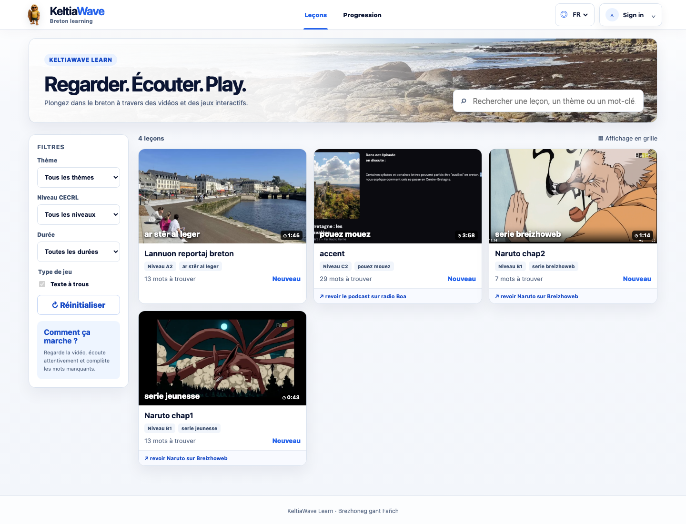
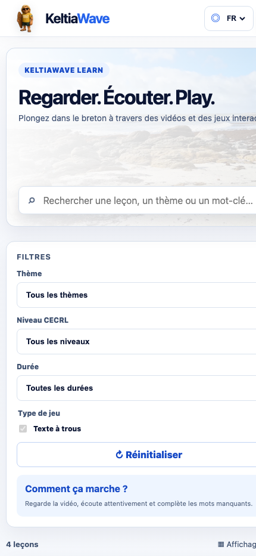
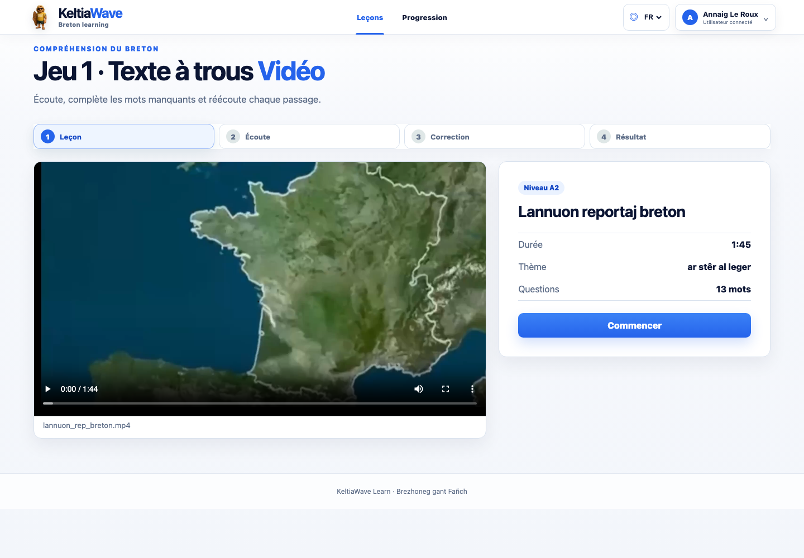
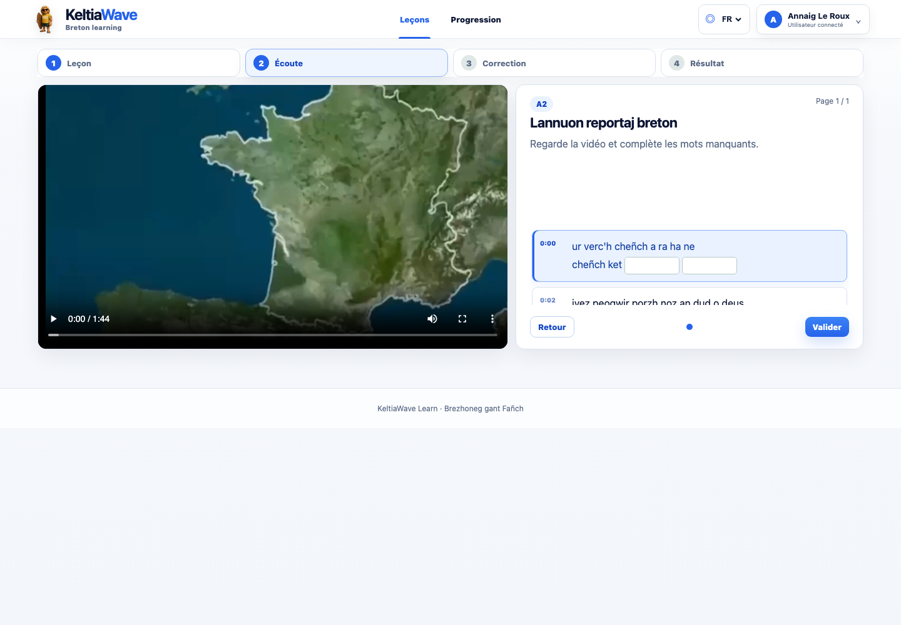
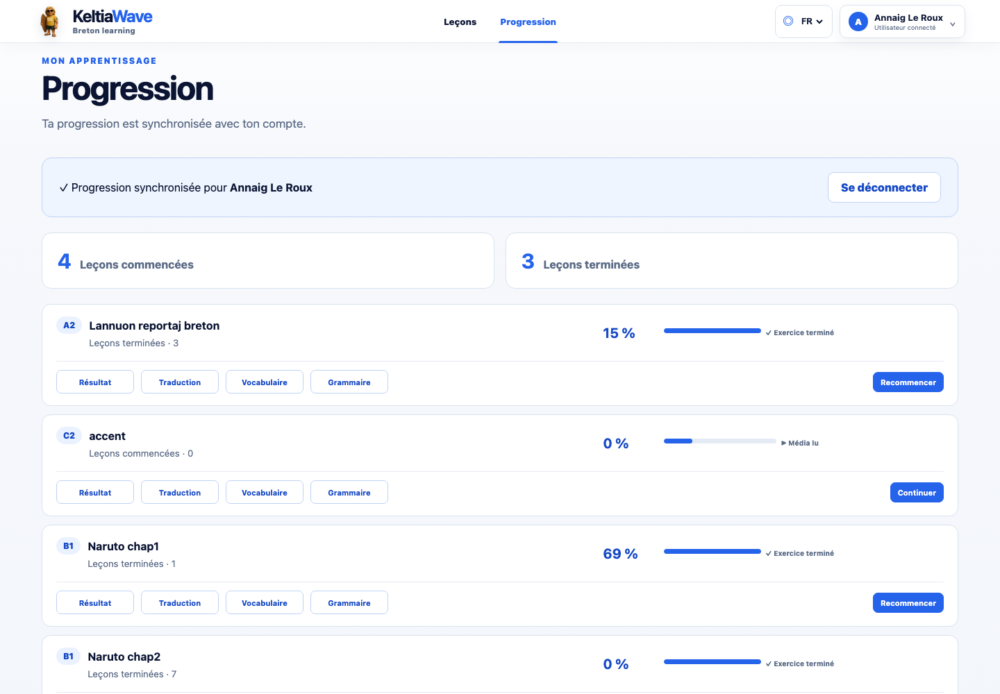
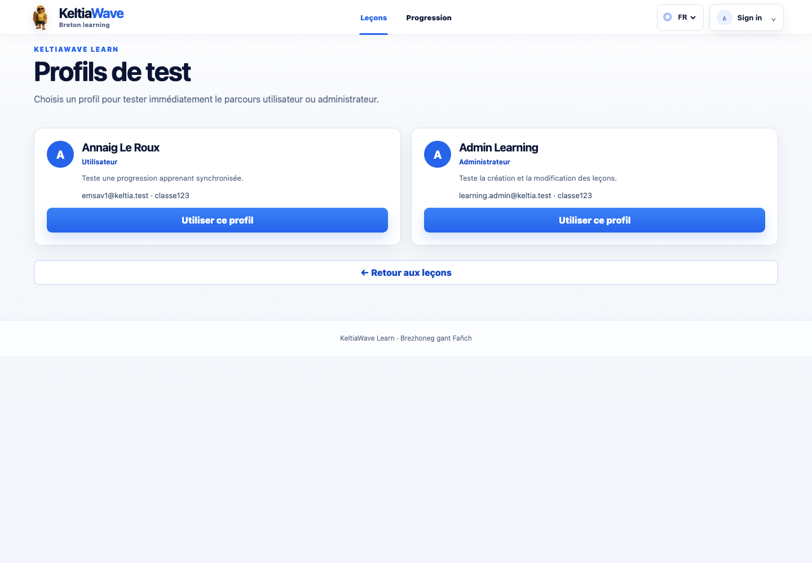
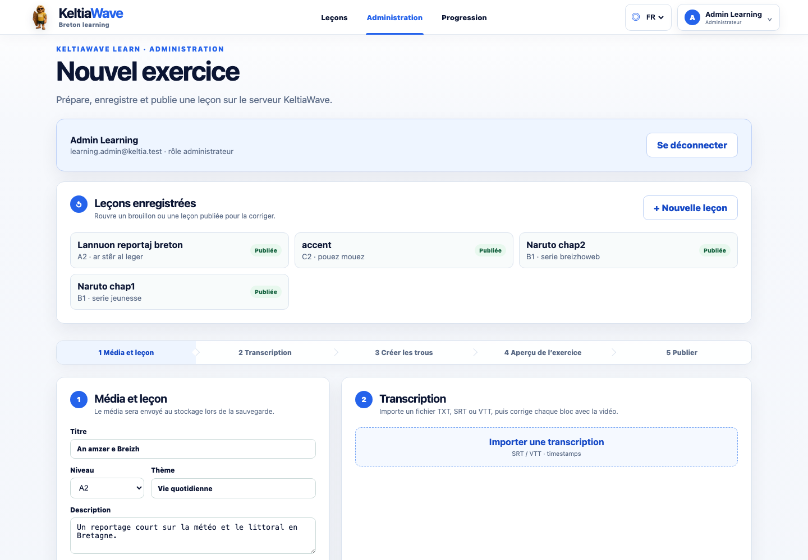
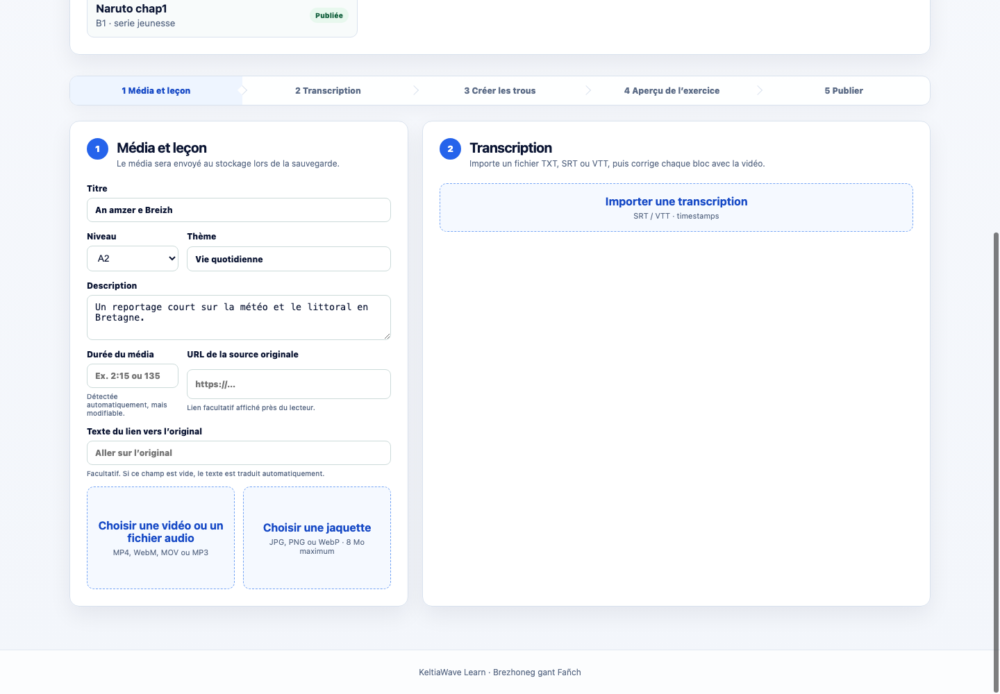
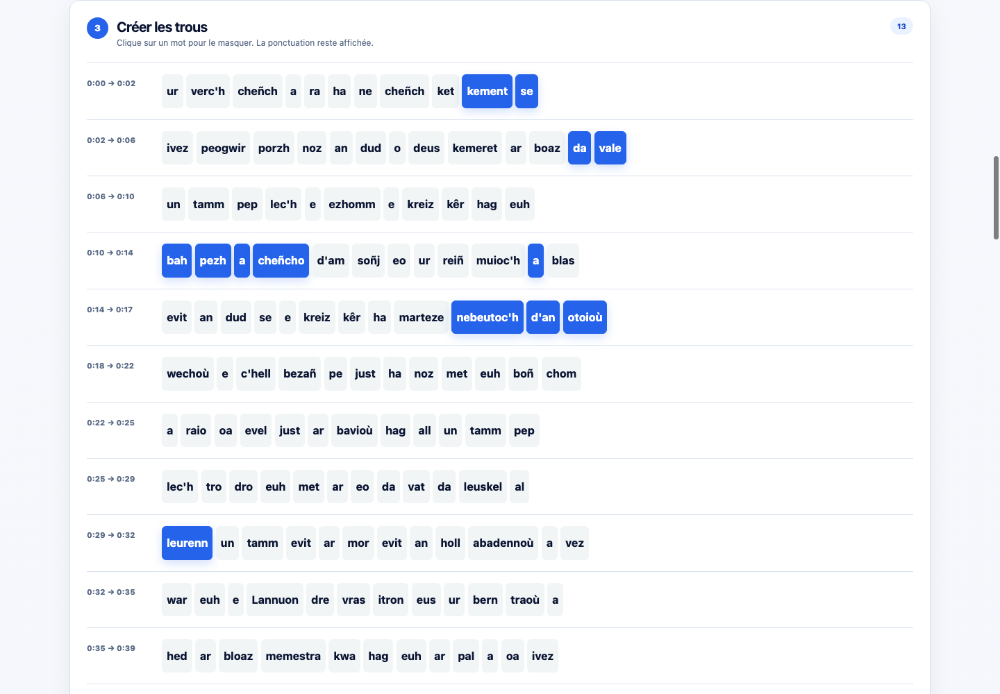
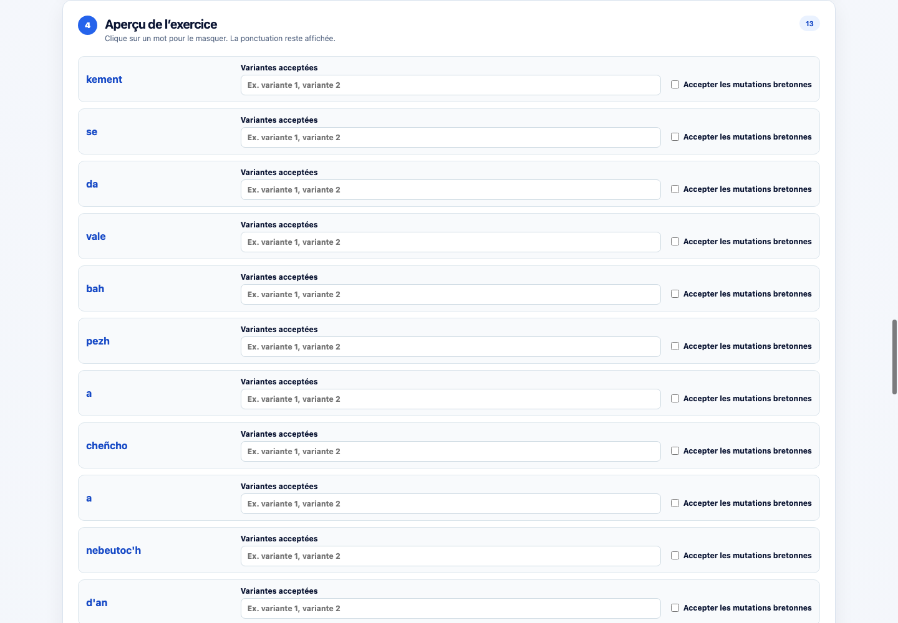

# Guide pratique — KeltiaWave Learn

Ce guide présente le parcours apprenant et les principales fonctions
d’administration de KeltiaWave Learn. Les captures ont été réalisées le
22 août 2026 depuis l’application locale avec des leçons de démonstration.

## 1. Ouvrir le catalogue

Depuis la racine du dépôt, lancer :

```bash
./start_learning.sh
```

Puis ouvrir <http://localhost:4300/>.



Le catalogue rassemble toutes les leçons publiées. Chaque carte indique :

- le titre et la jaquette ;
- le niveau CECRL ;
- le thème ;
- la durée du média ;
- le nombre de mots à retrouver ;
- l’état de progression.

La connexion n’est pas obligatoire. Sans compte, la progression reste dans le
navigateur. Avec un compte KeltiaWave, elle est synchronisée avec le serveur.

## 2. Rechercher et filtrer

La barre située dans le bandeau recherche simultanément dans le titre, le thème
et le niveau. La colonne **Filtres** permet de limiter les résultats par thème,
niveau CECRL et durée.

Le bouton **Réinitialiser** efface tous les critères. Si aucune leçon ne
correspond, retirer progressivement les filtres les plus restrictifs.

## 3. Utiliser l’application sur téléphone



Sur un écran étroit, les filtres précèdent la liste des leçons. Faire défiler la
page pour atteindre les cartes. Le sélecteur **FR / BR / EN** reste disponible
dans l’en-tête.

Pour un meilleur confort pendant un exercice vidéo, utiliser le téléphone en
mode paysage lorsque le texte ou le média est long.

## 4. Commencer une leçon

Cliquer sur la carte d’une leçon. L’écran de présentation affiche son titre, sa
description, son niveau, son thème, sa durée et le nombre de questions.



1. Lire la présentation.
2. Vérifier le volume du téléphone ou de l’ordinateur.
3. Cliquer sur **Commencer**.
4. Lancer le média avec les contrôles du lecteur.

Le média reste dans le panneau gauche et l’exercice apparaît à droite. Sur un
petit écran, les panneaux sont réorganisés verticalement.

## 5. Compléter le texte à trous

Pendant la lecture, le passage correspondant au son est surligné et recentré.
Saisir les mots entendus dans les champs vides.



La correction accepte automatiquement :

- les majuscules ou minuscules ;
- les apostrophes droites (`'`) ou typographiques (`’`) ;
- les différences d’espacement autour des mots et apostrophes ;
- les variantes ajoutées par l’administrateur ;
- les mutations bretonnes lorsque cette option est activée pour le mot.

Les boutons **Page précédente** et **Page suivante** parcourent les textes
longs. Cliquer sur **Valider** une fois la dernière page complétée.

## 6. Comprendre la correction

La correction utilise trois repères :

- une coche verte pour une réponse acceptée ;
- une croix rouge pour une réponse incorrecte ;
- la réponse attendue affichée sous une erreur.

Le bouton **Réécouter** replace le média au début du passage concerné. Il est
conseillé de réécouter une erreur avant de consulter sa traduction.

Après la dernière page, cliquer sur **Voir mon résultat**.

## 7. Exploiter le résultat

L’écran final affiche le score et quatre onglets :

- **Résultat** : score et mots réussis ou manqués ;
- **Traduction** : traduction française synchronisée avec le média ;
- **Vocabulaire** : mots importants et exemples ;
- **Grammaire** : explication et exemple associés à la leçon.

Pendant la relecture, les boutons **Sous-titres BR** et **Sous-titres FR**
permettent d’afficher le breton ou la traduction disponible sur le média.

## 8. Retrouver sa progression

Ouvrir **Progression** dans l’en-tête. La page distingue les leçons commencées
et terminées, affiche le meilleur score et permet d’ouvrir directement le
résultat, la traduction, le vocabulaire ou la grammaire.



Un visiteur conserve ces informations dans le stockage local de son navigateur.
La suppression des données du navigateur efface donc sa progression locale.

## 9. Utiliser les profils de test

Depuis le menu **Sign in**, cliquer sur **Profils de test**. Deux parcours sont
disponibles localement : utilisateur et administrateur.



- **Annaig Le Roux** ouvre le parcours apprenant et sa progression synchronisée ;
- **Admin Learning** donne accès à la création et à la modification des leçons.

Ces identifiants servent uniquement à la démonstration locale. Ils ne doivent
pas être réutilisés comme comptes administrateurs en production.

## 10. Créer une leçon en administration

L’administration est réservée aux comptes ayant le rôle `admin`.



1. Cliquer sur **Sign in** et se connecter.
2. Ouvrir **Administration**.
3. Saisir le titre, le niveau, le thème et la description.
4. Charger une vidéo MP4, WebM ou MOV, ou un fichier MP3.
5. Ajouter une jaquette JPEG, PNG ou WebP.
6. Importer une transcription TXT, SRT ou VTT.
7. Corriger le texte et les timestamps dans l’aperçu.
8. Cliquer sur les mots qui deviendront des trous.
9. Ajouter les traductions, le vocabulaire et la grammaire.
10. Prévisualiser, enregistrer le brouillon ou publier.

La durée détectée peut être corrigée manuellement. Une URL et un libellé peuvent
également renvoyer vers la source originale du média.

### Champs « Média et leçon »



- **Titre** : nom affiché dans le catalogue et sur le lecteur ;
- **Niveau** : niveau CECRL de A1 à C2 ;
- **Thème** : catégorie utilisée dans les filtres du catalogue ;
- **Description** : courte présentation destinée à l’apprenant ;
- **Durée du média** : durée détectée, modifiable en secondes ou au format
  `minutes:secondes` ;
- **URL de la source originale** : adresse publique facultative du contenu ;
- **Texte du lien vers l’original** : libellé facultatif affiché au lecteur ;
- **Média** : vidéo MP4, WebM ou MOV, ou fichier audio MP3 ;
- **Jaquette** : image JPEG, PNG ou WebP affichée dans le catalogue.

### Champs « Transcription »

- **Importer une transcription** : fichier TXT, SRT ou VTT ;
- **Début / Fin** : timestamps en secondes de chaque segment ;
- **Texte du bloc** : phrase bretonne correspondant au passage ;
- **Traduction française** : texte utilisé dans l’onglet Traduction et dans les
  sous-titres français.

Après l’import, lire le média et vérifier que chaque bloc est surligné au bon
moment. Corriger les timestamps avant de choisir les mots à masquer.

## 11. Choisir les mots à masquer

Dans **Créer les trous**, cliquer sur chaque mot que l’apprenant devra retrouver.
Les mots bleus sont sélectionnés ; la ponctuation reste visible et ne peut pas
devenir une réponse.



Choisir en priorité des mots audibles, utiles pédagogiquement et adaptés au
niveau annoncé. Éviter de masquer trop de mots consécutifs.

## 12. Configurer les réponses acceptées

Après avoir sélectionné les mots à masquer, chaque mot apparaît dans
**Aperçu de l’exercice** avec deux réglages :



- **Variantes acceptées** : saisir plusieurs formes séparées par des virgules,
  par exemple `Quimper, Kemper` ;
- **Accepter les mutations bretonnes** : activer la case uniquement lorsque les
  formes mutées doivent être considérées comme correctes.

La réponse originale reste toujours acceptée. Pour éviter une correction trop
permissive, réserver les variantes aux formes linguistiquement valides dans le
contexte de la phrase.

### Autres contenus pédagogiques

- **Vocabulaire** : mot breton, traduction et exemple ou note ;
- **Grammaire** : titre, explication, exemple breton et traduction ;
- **Aperçu joueur** : ouvre la leçon sans la publier ;
- **Enregistrer le brouillon** : conserve le travail sans rendre la leçon
  publique ;
- **Publier** : rend la leçon visible dans le catalogue.

## 13. Vérifier avant publication

Avant de publier une leçon, contrôler :

- que le média se lit du début à la fin ;
- que les timestamps suivent correctement la voix ;
- qu’au moins un mot est masqué ;
- que toutes les variantes sont réellement acceptables ;
- que la tolérance des mutations n’est activée que lorsque nécessaire ;
- que les traductions ne révèlent pas involontairement les réponses ;
- que la jaquette et le lien vers la source sont corrects ;
- que l’aperçu fonctionne sur ordinateur et téléphone.

## Ressources complémentaires

- [README du projet](./README.md)
- [Roadmap](./ROADMAP.md)
- [Point de reprise](./CHECKPOINT.md)
