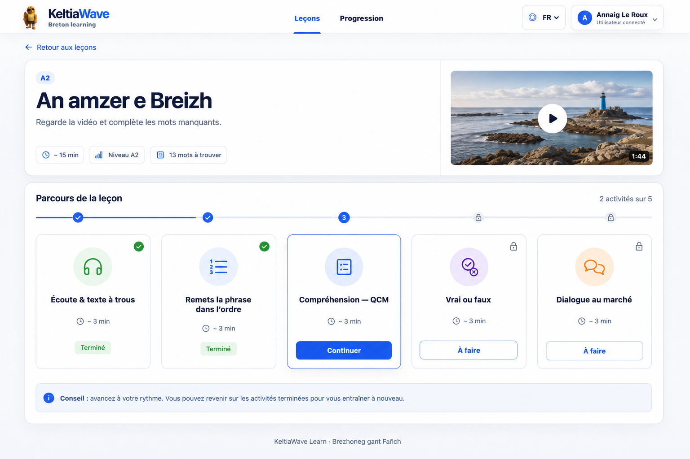
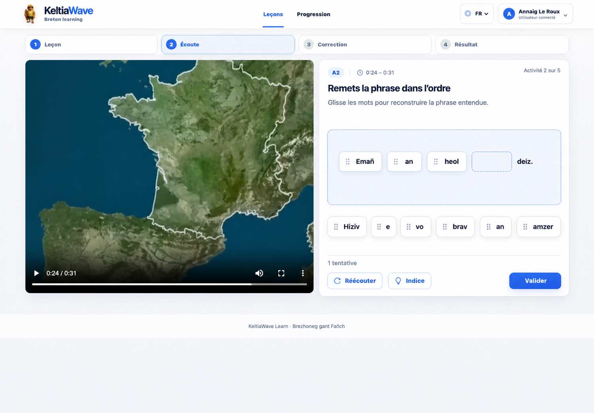
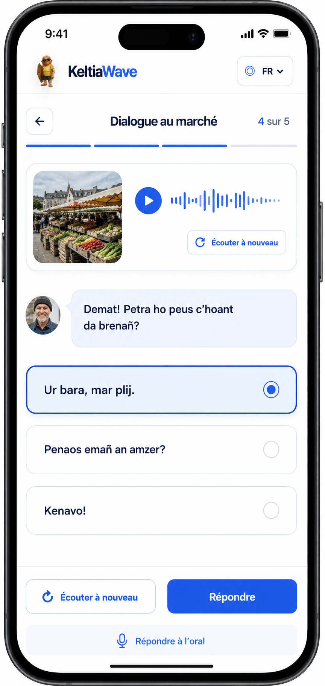

# Propositions UX — jeux multiples

Ces maquettes exploratoires illustrent des pistes pour faire évoluer
KeltiaWave Learn vers un parcours composé de plusieurs types d’activités. Elles
servent de support à la roadmap et ne décrivent pas encore une interface
implémentée.

## Parcours multi-activités

La leçon présente les jeux comme les étapes d’un même parcours et indique leur
état, leur durée et la progression générale.

## Phrase à remettre dans l’ordre

Le lecteur et la synchronisation existants sont conservés. L’exercice remplace
le texte à trous par des mots déplaçables dans le panneau droit.

## Dialogue à choix sur mobile

Cette proposition commence par des réponses prédéfinies et réserve la réponse
orale à une évolution ultérieure.

Les formulations bretonnes et les contenus pédagogiques devront être validés
avant une éventuelle implémentation.
